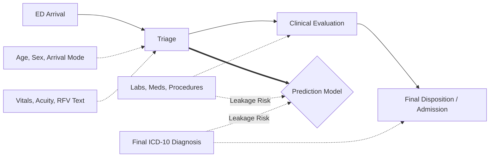
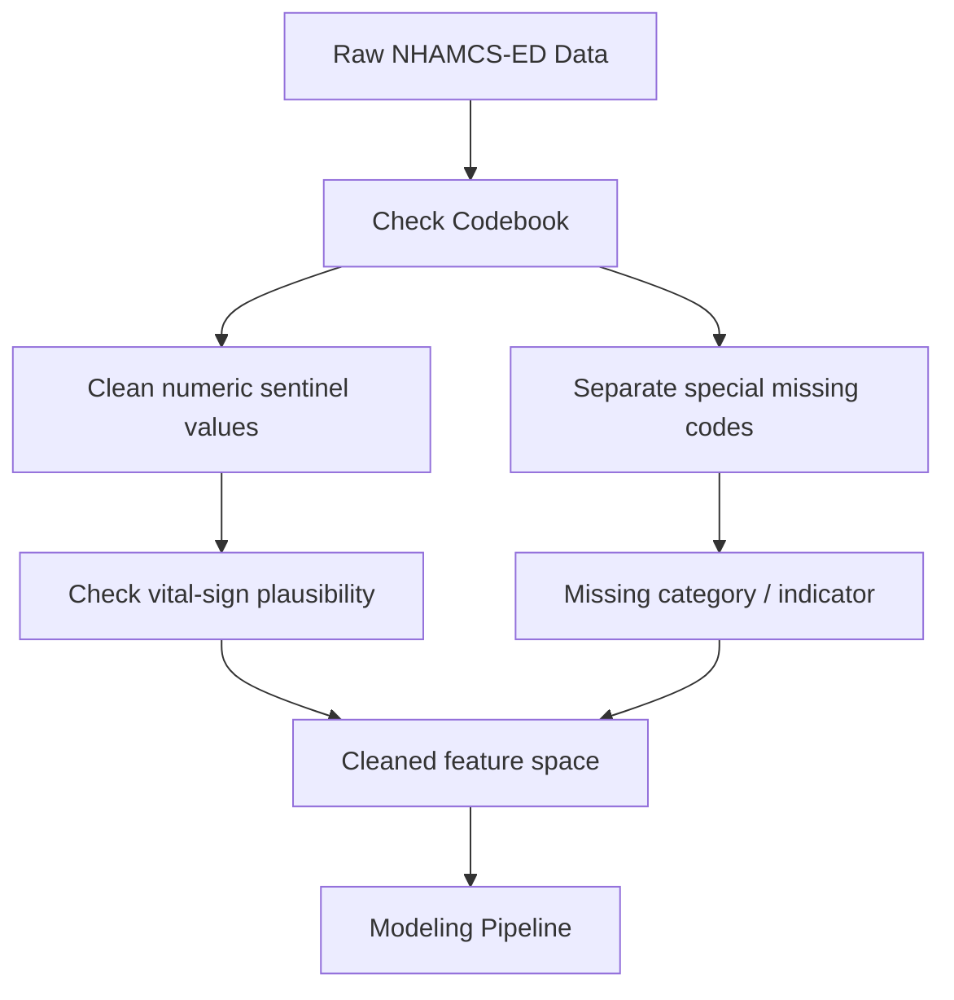

NHAMCS-ED looks almost ideal for clinical AI experiments: it combines structured emergency department visit variables with short reason-for-visit text. But it is a national probability survey, not a hospital EHR extract. Across my IV fluid utilization and hospital admission prediction projects, the biggest lesson was that the hard part is often not the model itself; it is deciding what the model is allowed to know, what the data actually represent, and what claims the analysis can support.

## 1. Define the Prediction Moment First

Before choosing variables, write one sentence:

> The model predicts the outcome at ED arrival or triage.

That sentence decides the feature set.

If the prediction point is triage, then age, sex, arrival mode, triage acuity, initial vital signs, and reason-for-visit text may be appropriate predictors. But final diagnosis, final disposition, length of visit, number of procedures, and number of medications are usually not appropriate. They occur after the prediction moment and may leak information about the outcome.

The most useful practical tool is a feature eligibility table:

| Variable type            | Available when?  | Use for early prediction? |
| ------------------------ | ---------------- | ------------------------- |
| Age, sex, arrival mode   | Arrival / triage | Yes                       |
| Initial vitals, acuity   | Triage           | Yes                       |
| Reason-for-visit text    | Early visit      | Usually yes               |
| Final diagnosis          | After evaluation | No                        |
| Disposition              | End of visit     | No                        |
| Procedures / medications | During care      | Usually no                |

This simple table can prevent a model from quietly learning the future.



## 2. Remember That NHAMCS-ED Is Survey Data

For model comparison, it may be acceptable to train an unweighted model and report sample-level performance, as long as you say that clearly.

But national claims are different.

NHAMCS-ED includes `PATWT`, the patient visit weight used to estimate national ED visits from sampled records. It also includes masked design variables such as `CSTRATM` and `CPSUM` for variance estimation.

A simple rule:

* sample-level prediction: unweighted analysis may be acceptable
* national descriptive estimates: use `PATWT`
* confidence intervals and hypothesis tests: account for survey design when possible
* subgroup claims: be cautious with small cells

The key distinction is not technical; it is interpretive. A row count is not automatically a national estimate.

A toy example makes the point:

```python
import matplotlib.pyplot as plt
import numpy as np

age_groups = ["<18", "18–45", "46–65", ">65"]
unweighted_counts = np.array([500, 1200, 800, 400])
weighted_estimates = unweighted_counts * np.array([80, 120, 200, 250])

fig, axes = plt.subplots(1, 2, figsize=(10, 4))

axes[0].bar(age_groups, unweighted_counts)
axes[0].set_title("Unweighted Sample")
axes[0].set_ylabel("Raw row count")

axes[1].bar(age_groups, weighted_estimates)
axes[1].set_title("Weighted Estimate")
axes[1].set_ylabel("Estimated ED visits")

fig.suptitle("Why Survey Weights Matter")
fig.tight_layout()
plt.show()
```

## 3. Clean Codes Before Modeling

Clinical data cleaning is not just formatting. It is deciding what each value means.

In NHAMCS-ED, missing values can mean blank, unknown, not applicable, uncodable, or special sentinel codes. These should not be blindly converted to zero or collapsed into one generic missing bucket.

A better workflow is:



This is especially important for vitals. A missing respiratory rate does not mean “normal.” It may mean “not documented” or “not clinically prioritized.”

Outcome definitions also need codebook-backed logic. For example, myocardial infarction should be defined using ICD-10 families such as `I21` or `I22`, not by searching for the keyword `"MI"`. Loose keyword matching can create false positives.

For any diagnosis-based outcome, I would now create a small reusable outcome function and inspect positive, negative, and ambiguous cases before modeling.

## 4. Treat RFV Text as Short Coded Narrative, Not Full Clinical Notes

The reason-for-visit fields are one of the most attractive parts of NHAMCS-ED, but they are easy to oversell.

They are useful, but they are not full emergency department notes. They are short, telegraphic, structured-adjacent fields. That changes the NLP strategy.

In short RFV text, simple count-based features may perform surprisingly well because the signal is often direct: “chest pain,” “vomiting,” “dehydration,” “abdominal pain,” or “shortness of breath.” A transformer embedding may sound more advanced, but it is not automatically better if the text is short and sparse.

For this kind of data, I would:

* compare simple text baselines first
* avoid calling it full clinical NLP unless raw notes are used
* test structured-only, text-only, and combined models
* report whether text adds value beyond vitals, acuity, age, payer, and arrival mode

The question is not always which language model is newest. Sometimes the better question is which representation fits the actual text.

## 5. Keep the Test Set Clean

Leakage can also happen during model selection. If the test set is used repeatedly to choose features, tune thresholds, compare models, and select the final result, it is no longer a true test set.

A safer workflow is:

1. Fit preprocessing only on training data.
2. Use validation data for feature and threshold selection.
3. Use the test set once for final evaluation.
4. Report discrimination and calibration when clinically relevant.
5. For imbalanced outcomes, try class weights and threshold tuning before oversampling.

If oversampling is used, it should happen inside the training fold, not before the split.

## What I Would Do Differently Now

NHAMCS-ED is still a useful public dataset for clinical AI method development. But I would now approach it with four boundaries in mind:

1. **Timing boundary:** early prediction should use early-available variables only.
2. **Survey boundary:** national claims require weights and survey design.
3. **Text boundary:** RFV fields are short coded narratives, not full clinical notes.
4. **Interpretation boundary:** model performance is not clinical causality.

That does not make NHAMCS-ED less useful. It makes it more valuable.

Its value is not that it behaves like a clean EHR benchmark. Its value is that it teaches the discipline required for real clinical AI work: define the prediction moment, respect the data source, build outcomes carefully, and be honest about what the model can and cannot claim.

## Sources and Links

* CDC/NCHS NHAMCS documentation directory: https://ftp.cdc.gov/pub/Health_Statistics/NCHS/Dataset_Documentation/NHAMCS/
* 2022 NHAMCS-ED public-use data file documentation: https://ftp.cdc.gov/pub/Health_Statistics/NCHS/Dataset_Documentation/NHAMCS/doc22-ed-508.pdf
* IV fluid utilization paper: https://doi.org/10.7717/peerj-cs.3441
* IV fluid reproducibility repository: https://github.com/hwcmu/IVF-prediction
* Hospital admission prediction paper: https://doi.org/10.1177/20552076251331319
