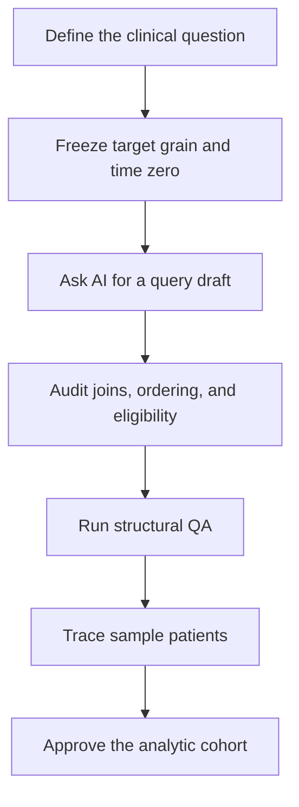

AI can now produce polished SQL in seconds. That does not make clinical data work easier to trust.

A generated query may run without errors, return plausible numbers, and still construct the wrong cohort. It does not know whether one row should represent a patient or an encounter. It does not know which timestamps define baseline or follow-up. It cannot decide whether a result is clinically credible.

> **AI makes SQL cheaper to write, but not cheaper to get right.**

The analyst's role is therefore shifting. We are becoming less like query typists and more like accountable reviewers: the people who define the clinical question, inspect how it became code, and decide whether the resulting cohort is fit for analysis.

## Start With the Grain

Every clinical table has a natural grain: what one row represents.

| Table | Typical row meaning |
| --- | --- |
| `patients` | One patient |
| `admissions` | One hospitalization |
| `diagnoses` | One diagnosis recorded for an encounter |
| `labs` | One laboratory result |

Suppose the question is: *How many patients were hospitalized in 2020?*

```sql
SELECT COUNT(*) AS patient_count
FROM patients p
JOIN admissions a ON p.subject_id = a.subject_id
WHERE a.admittime >= '2020-01-01'
  AND a.admittime <  '2021-01-01';
```

The alias says `patient_count`, but the query counts joined rows. At this point, one row represents an admission. A patient hospitalized three times is counted three times.

If the target grain is one patient, the count must reflect that grain:

```sql
SELECT COUNT(DISTINCT p.subject_id) AS patient_count
FROM patients p
JOIN admissions a ON p.subject_id = a.subject_id
WHERE a.admittime >= '2020-01-01'
  AND a.admittime <  '2021-01-01';
```

`COUNT(DISTINCT ...)` is not a universal repair. It is correct here only because the question explicitly asks for patients.

**Review reflex:** When you see `COUNT`, ask what one row represents at that exact point in the query.

## Joins Can Multiply Evidence

The more dangerous version appears when two one-to-many tables are joined to the same encounter. If one admission has four diagnoses and six laboratory results, joining both child tables directly can create 24 rows.

Nothing crashes. Totals, averages, and event counts may simply become inflated.

A safer pattern is to summarize each child table to the intended grain before combining them:

```sql
WITH diagnosis_summary AS (
    SELECT hadm_id, COUNT(DISTINCT diagnosis_code) AS diagnosis_count
    FROM diagnoses
    GROUP BY hadm_id
),
lab_summary AS (
    SELECT hadm_id, COUNT(*) AS lab_count
    FROM labs
    GROUP BY hadm_id
)
SELECT a.hadm_id,
       d.diagnosis_count,
       l.lab_count
FROM admissions a
LEFT JOIN diagnosis_summary d ON a.hadm_id = d.hadm_id
LEFT JOIN lab_summary l ON a.hadm_id = l.hadm_id;
```

The design decision comes before the join: define whether the analytic table should contain one row per patient, admission, or another clinical unit.

## One Word Can Move Time Zero

Window functions are useful for choosing a patient's first admission while preserving encounter-level records. They are also excellent at producing silent errors.

```sql
SELECT subject_id, hadm_id, admittime
FROM (
    SELECT subject_id,
           hadm_id,
           admittime,
           ROW_NUMBER() OVER (
               PARTITION BY subject_id
               ORDER BY admittime DESC
           ) AS rn
    FROM admissions
) t
WHERE rn = 1;
```

The structure looks right and the output contains one row per patient. But `DESC` selects the latest admission, not the first. If that date becomes the index date, every downstream baseline and follow-up window begins from the wrong event.

The direction and tie-breaking rule must match the clinical definition:

```sql
ROW_NUMBER() OVER (
    PARTITION BY subject_id
    ORDER BY admittime ASC, hadm_id ASC
)
```

The secondary key makes the result deterministic when timestamps tie.

**Review reflex:** Say the ordering aloud: *earliest or latest?* Then check whether the SQL actually implements it.

## Time Leakage Often Looks Reasonable

Once an index date is defined, baseline features must use information available before that date. A feature query that quietly includes post-index laboratory results can make a model look stronger by giving it knowledge from the future.

```sql
WHERE labtime >= index_date - INTERVAL '365 days'
  AND labtime <  index_date
```

The exact date syntax varies by SQL dialect. The important part is the temporal contract: baseline stops before time zero, and follow-up begins only where the outcome definition says it should.

Leakage is not merely a machine-learning problem. It begins during cohort construction, often inside a join or date filter that appears perfectly ordinary.

## Review the Cohort, Not Just the Query

A useful AI-assisted workflow is:



Structural checks should be explicit:

```sql
SELECT COUNT(*) AS rows,
       COUNT(DISTINCT patient_id) AS patients
FROM analytic_cohort;
```

```sql
SELECT patient_id, COUNT(*) AS n
FROM analytic_cohort
GROUP BY patient_id
HAVING COUNT(*) > 1;
```

```sql
SELECT *
FROM analytic_cohort
WHERE baseline_event_date >= index_date;
```

Then manually trace a few patients from source records to final inclusion. Row counts catch structural problems; patient-level review tests whether the query matches the clinical story.

## The Review Checklist

Before approving AI-generated clinical SQL, ask:

- What does one output row represent?
- Can any join multiply records?
- Are all required join keys present?
- Does `ORDER BY` select the intended first or last event?
- Are ties resolved deterministically?
- Are baseline, index, and follow-up windows explicit?
- Does any feature use post-index information?
- Do row counts and distinct-patient counts make sense?
- Can several patients be traced manually from source to output?

Learning SQL still matters. The goal, however, is no longer to memorize every function or write every window expression from a blank screen. It is to read confidently, make targeted corrections, and recognize when a technically valid query answers the wrong clinical question.

AI can draft the query. The analyst still owns the cohort.
