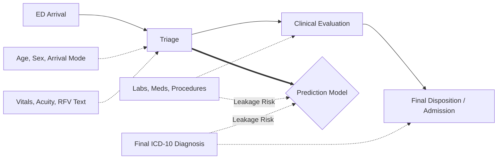
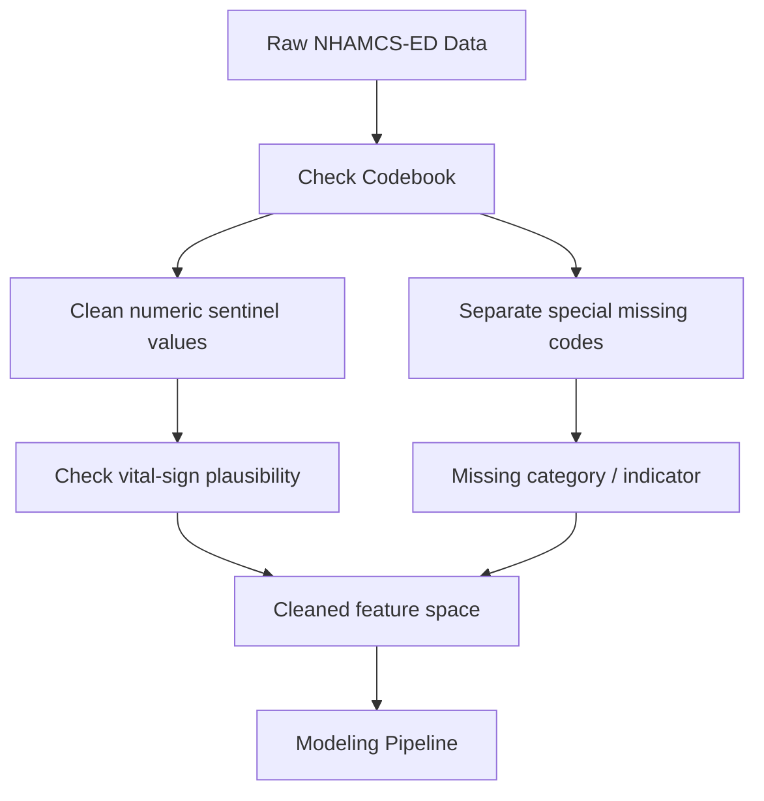

NHAMCS-ED combines structured emergency-department visit variables with short reason-for-visit text, but it is a national probability survey rather than a hospital EHR extract. Its main lesson for clinical AI is to decide what a model may know, what the data represent, and what the analysis can claim.

## 1. Define the Prediction Moment First

Before choosing variables, write one sentence:

> The model predicts the outcome at ED arrival or triage.

If the prediction point is triage, then age, sex, arrival mode, triage acuity, initial vital signs, and reason-for-visit text may be appropriate predictors. But final diagnosis, final disposition, length of visit, number of procedures, and number of medications are usually not appropriate. They occur after the prediction moment and may leak information about the outcome.

The most useful practical tool is a feature eligibility table:

| Variable type            | Available when?  | Use for early prediction? |
| ------------------------ | ---------------- | ------------------------- |
| Age, sex, arrival mode   | Arrival / triage | Yes                       |
| Initial vitals, acuity   | Triage           | Yes                       |
| Reason-for-visit text    | Early visit      | Usually yes               |
| Final diagnosis          | After evaluation | No                        |
| Disposition              | End of visit     | No                        |
| Procedures / medications | During care      | Usually no                |

## 2. Remember That NHAMCS-ED Is Survey Data

For model comparison, an unweighted model can be acceptable if results are described as sample-level. National claims are different: `PATWT` estimates national ED visits from sampled records, and masked design variables such as `CSTRATM` and `CPSUM` support variance estimation.

A simple rule:

* sample-level prediction: unweighted analysis may be acceptable
* national descriptive estimates: use `PATWT`
* confidence intervals and hypothesis tests: account for survey design when possible
* subgroup claims: be cautious with small cells

The distinction is interpretive: a row count is not automatically a national estimate.

## 3. Clean Codes Before Modeling

Clinical data cleaning is deciding what each value means. In NHAMCS-ED, a missing value can be blank, unknown, not applicable, uncodable, or a sentinel code; these should not be converted blindly to zero or one generic missing bucket.

A better workflow is:

This matters for vitals: a missing respiratory rate does not mean normal. Outcome definitions also need codebook-backed logic. For example, define myocardial infarction with ICD-10 families such as `I21` or `I22`, not a keyword search for `"MI"`; inspect positive, negative, and ambiguous cases before modeling.

## 4. Treat RFV Text as Short Coded Narrative, Not Full Clinical Notes

The reason-for-visit fields are one of the most attractive parts of NHAMCS-ED, but they are easy to oversell.

They are useful but not full emergency-department notes: they are short, telegraphic, structured-adjacent fields. Simple count-based features can work well when the signal is direct; a transformer embedding is not automatically better for short, sparse text.

For this kind of data, I would:

* compare simple text baselines first
* avoid calling it full clinical NLP unless raw notes are used
* test structured-only, text-only, and combined models
* report whether text adds value beyond vitals, acuity, age, payer, and arrival mode

Choose the representation that fits the actual text, not the newest language model.

## 5. Keep the Test Set Clean

Leakage can also happen during model selection. A test set repeatedly used to choose features, tune thresholds, compare models, and select the final result is no longer a true test set.

A safer workflow is:

1. Fit preprocessing only on training data.
2. Use validation data for feature and threshold selection.
3. Use the test set once for final evaluation.
4. Report discrimination and calibration when clinically relevant.
5. For imbalanced outcomes, try class weights and threshold tuning before oversampling.

If oversampling is used, it should happen inside the training fold, not before the split.

## What I Would Do Differently Now

NHAMCS-ED remains useful for clinical-AI method development, with four boundaries:

1. **Timing boundary:** early prediction should use early-available variables only.
2. **Survey boundary:** national claims require weights and survey design.
3. **Text boundary:** RFV fields are short coded narratives, not full clinical notes.
4. **Interpretation boundary:** model performance is not clinical causality.

Its value is not that it behaves like a clean EHR benchmark, but that it teaches the discipline required for real clinical AI work: define the prediction moment, respect the data source, build outcomes carefully, and be honest about the model’s limits.

## Sources and Links

* CDC/NCHS NHAMCS documentation directory: https://ftp.cdc.gov/pub/Health_Statistics/NCHS/Dataset_Documentation/NHAMCS/
* 2022 NHAMCS-ED public-use data file documentation: https://ftp.cdc.gov/pub/Health_Statistics/NCHS/Dataset_Documentation/NHAMCS/doc22-ed-508.pdf
* IV fluid utilization paper: https://doi.org/10.7717/peerj-cs.3441
* IV fluid reproducibility repository: https://github.com/hwcmu/IVF-prediction
* Hospital admission prediction paper: https://doi.org/10.1177/20552076251331319
