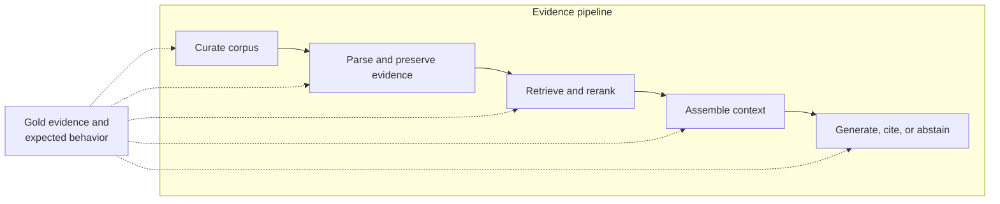

A RAG demo can look successful for a surprisingly weak reason: it retrieved a passage containing the same words as the question.

Even a correct answer may conceal a failure. The cited passage might not support the claim. A condition may have been separated from its exception. Or the model may have answered from prior knowledge while merely decorating the response with a retrieved citation.

The more useful mental model is:

> A RAG system is not a chatbot with a vector database. It is an evidence pipeline with several independently testable failure points.

## A Working Demo Is Not Yet Evidence

A basic RAG workflow can load a document collection, divide it into passages, index the passages, and retrieve a small set of candidates for generation. Tests can confirm that each step runs and that retrieved text comes from the intended source. Those checks show that the plumbing works.

They do not show that the system retrieved the exact claim and its qualifiers, that every answer is supported by its citation, that conflicting sources remain visible, or that the model declines a question the corpus cannot answer. The more useful question is therefore:

> What would it take to evaluate RAG as an evidence system rather than as a working demo?

## Five Boundaries Where Evidence Can Be Lost

The pipeline has five operational stages. Evaluation is not a sixth stage at the end; it is the instrument that tests every stage.

| Stage | Typical failure | What to test |
| --- | --- | --- |
| Corpus governance | The corpus is incomplete, outdated, duplicated, or weakly authoritative | Source authority, coverage, version, date, inclusion rules |
| Parsing and indexing | OCR corrupts a table, or chunking separates a claim from its condition or exception | Span survival, table and caption integrity, metadata, provenance |
| Retrieval and reranking | A passage is topically similar but does not support the answer | Evidence recall@k, unique-source coverage, duplicate-aware precision |
| Context assembly | Relevant evidence is retrieved but truncated, buried, or mixed with unresolved conflict | Context sufficiency, ordering ablations, conflict visibility |
| Grounded generation | The answer introduces an unsupported claim, cites the wrong passage, or refuses to abstain | Claim correctness, completeness, citation entailment, citation completeness, abstention |

Each stage requires a different intervention. Increasing `top_k` cannot repair a missing source. Changing the prompt cannot restore a qualifier lost during parsing. A high retrieval score cannot prove that the model used the retrieved evidence faithfully.

## The Same Final Answer Can Hide Different Systems

End-to-end answer accuracy collapses distinct outcomes into one number:

| Observed outcome | What it may actually mean |
| --- | --- |
| Evidence absent, answer wrong | The corpus or retriever failed |
| Evidence present, answer wrong | Context assembly or generation failed |
| Answer correct, citation unsupported | The model may be correct but ungrounded |
| Evidence insufficient, answer confident | The abstention policy failed |
| Sources conflict, answer presents one view as settled | Evidence disagreement was hidden |

These are not equivalent errors. They point to different owners, different fixes, and different risks. A useful evaluation report should preserve that distinction instead of reporting only a final accuracy or a single judge score.

## Gold Evidence Must Survive Chunking Changes

A common evaluation shortcut is to label a particular chunk as the correct retrieval target. That quietly makes the benchmark dependent on the current chunking strategy. Change the chunk size or overlap, and the supposed ground truth disappears.

Gold evidence should instead be recorded at a more stable level:

- source document and version;
- page, section, table, or character span;
- the atomic claim the evidence supports;
- any condition, exception, or conflicting source that must remain attached.

The retriever can then be judged on whether its returned set covers the required evidence, regardless of how the corpus was segmented. Overlapping chunks should also be consolidated by source and span; otherwise near-duplicates can make retrieval results look more diverse or precise than they are.

## A Minimum Evaluation Suite

A compact but useful benchmark should contain several kinds of questions, not only ordinary fact lookup.

1. **Direct-evidence cases:** one source contains a clear answer.
2. **Boundary cases:** the answer depends on a qualifier, exception, footnote, table, or neighboring paragraph.
3. **Multi-source and conflict cases:** evidence must be combined, or source disagreement must be surfaced.
4. **Insufficient-evidence cases:** the corpus does not justify an answer.
5. **Distractor cases:** plausible but irrelevant passages compete with the supporting evidence.

The reporting layer should keep retrieval and answer behavior separate:

| Evaluation target | Minimum useful measures |
| --- | --- |
| Retrieval | Evidence recall@k, unique-source coverage, duplicate-aware precision |
| Context | Required-claim coverage, missing qualifiers, unresolved conflicts |
| Answer | Claim-level correctness and completeness |
| Citations | Whether each citation entails its claim, and whether important claims are cited |
| Abstention | Acceptable-answer rate, acceptable-abstention rate, unsupported-answer rate |

Frameworks such as RAGAS can automate parts of this process, while diagnostic approaches such as RAGChecker separate retrieval and generation failures more explicitly. Automated judges are still measurements, not ground truth. Before relying on them, I would calibrate their decisions against a small human-labeled set, inspect disagreements, and report where the judge is unreliable.

## A Practical Release Loop

Before treating an evidence-backed assistant as ready, I would use a release loop like this:

1. Freeze and identify the corpus version.
2. Define expected behavior and gold evidence independently of chunk IDs.
3. Establish simple baselines, including no-retrieval and lexical or dense retrieval where appropriate.
4. Run controlled changes to chunking, `top_k`, reranking, and context order.
5. Log a per-query trace from question to retrieved sources, assembled context, generated claims, citations, and final disposition.
6. Classify failures by pipeline stage before tuning the system.
7. Recheck the benchmark whenever the corpus, retriever, prompt, model, or citation policy changes.

This makes improvement legible. If evidence recall rises while citation support falls, the system has not simply become "better." It has traded one failure mode for another.

## The Design Principle

RAG gives a model access to external evidence. It does not guarantee that the evidence is complete, current, authoritative, relevant, or correctly used.

A trustworthy system should be able to show more than a fluent answer. It should make clear which evidence supports which claim, preserve meaningful disagreement, identify the corpus version it relied on, and say when the available evidence is insufficient.

> Do not evaluate a RAG system only where the answer appears. Evaluate every boundary where evidence can be lost.

That is the shift from a persuasive demo to an auditable information system.

## Sources

- Lewis P, et al. [Retrieval-Augmented Generation for Knowledge-Intensive NLP Tasks](https://papers.nips.cc/paper_files/paper/2020/hash/6b493230205f780e1bc26945df7481e5-Abstract.html). NeurIPS 2020.
- Es S, et al. [RAGAS: Automated Evaluation of Retrieval Augmented Generation](https://aclanthology.org/2024.eacl-demo.16/). EACL 2024 System Demonstrations.
- Ru D, et al. [RAGChecker: A Fine-grained Framework for Diagnosing Retrieval-Augmented Generation](https://arxiv.org/abs/2408.08067). 2024.
- Gao T, et al. [Enabling Large Language Models to Generate Text with Citations](https://aclanthology.org/2023.emnlp-main.398/). EMNLP 2023.
- Saad-Falcon J, et al. [ARES: An Automated Evaluation Framework for Retrieval-Augmented Generation Systems](https://aclanthology.org/2024.naacl-long.20/). NAACL 2024.
- Peng X, et al. [Unanswerability Evaluation for Retrieval Augmented Generation](https://aclanthology.org/2025.acl-long.415/). ACL 2025.
