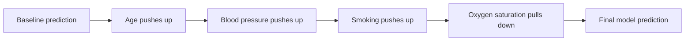
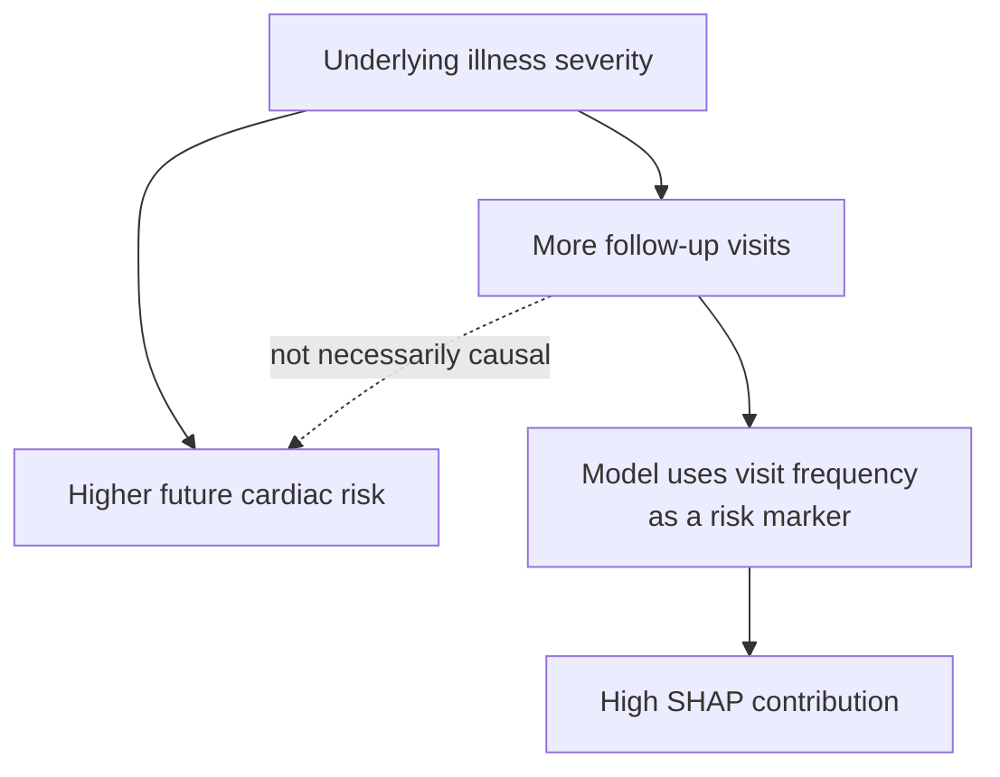

In clinical AI papers, I often see SHAP plots used as if they explain the disease process itself. The figure may look technical and persuasive, but the interpretation often goes too far:

> "This variable has a high SHAP value, so it is an important clinical cause."

That is usually not justified.

SHAP is useful. It can show what a trained model relied on when making a prediction. But its boundary should be clear:

> SHAP explains model behavior. It does not prove disease mechanism, treatment effect, or real-world causality.

This note is for clinicians, clinical researchers, and reviewers who read machine-learning papers but do not work in AI methods every day.

---

## 1. What SHAP Actually Explains

SHAP stands for **SHapley Additive exPlanations**. A plain-language version is:

> SHAP divides a model's prediction into contributions from each input feature.

Suppose a model predicts high risk of hospital admission. SHAP asks:

> Which features pushed this model prediction upward or downward compared with a baseline?

| Feature | SHAP-style contribution | Plain meaning |
|---|---:|---|
| High blood pressure | +0.18 | Pushed the model prediction upward |
| Older age | +0.12 | Pushed the model prediction upward |
| Current smoker | +0.08 | Pushed the model prediction upward |
| Normal oxygen saturation | -0.05 | Pulled the model prediction downward |

The exact scale depends on the model. In some implementations, SHAP values are on an internal model scale, such as log-odds, not directly percentage-point risk changes.

The safe interpretation is simple:

> SHAP explains the prediction relative to a baseline. It does not automatically explain the patient's biology.

---

## 2. Model Dependence Is Not Causality

Clinical readers often want to know whether a feature is a cause, a risk marker, or just something the model used. SHAP answers only one part of that.

| Question | Can SHAP answer it? |
|---|---|
| Why did the model predict high risk for this patient? | Yes |
| Which variables did the model rely on? | Yes |
| Is this variable associated with the outcome? | Partly, through the model |
| Does this variable cause the outcome? | No |
| If we intervene on this variable, how much will risk change? | No |

Example: imagine a model predicting one-year coronary heart disease risk. One input variable is the number of cardiology follow-up visits. Patients with more visits may have higher future risk because sicker patients are followed more closely.

SHAP may show that follow-up visits strongly increase the model's predicted risk. But the clinical interpretation should be:

> "The model is using follow-up frequency as a marker of underlying illness severity."

not:

> "Cardiology visits cause heart disease."

This is the core danger: if we confuse SHAP with causality, we may turn a severity marker into a false treatment target.

---

## 3. When SHAP Is Useful

SHAP is helpful when used for the right question.

**Explain an individual prediction**

> "Why did the model flag this patient as high risk?"

SHAP can show whether the model relied on age, vital signs, labs, symptoms, or text-derived features.

**Audit model behavior**

SHAP can help detect whether the model learned clinically plausible patterns or suspicious shortcuts.

Good signs:

- Known risk markers appear important.
- Direction roughly matches clinical expectations.
- Similar patients have similar explanations.

Warning signs:

- Hospital ID, bed number, timestamp artifacts, or data-entry patterns dominate the explanation.
- Variables recorded after the prediction time appear important.
- Site-specific workflow variables replace patient-level information.

**Communicate model behavior**

Better:

> "The model assigned higher predicted risk partly because this patient had high blood pressure and abnormal labs."

Too strong:

> "High blood pressure caused this outcome because SHAP ranked it highly."

---

## 4. Common Misuses and Limits

Most SHAP problems in clinical AI papers come from overinterpretation.

**Using SHAP as causal evidence**

SHAP cannot tell us whether lowering blood pressure, changing medication, or ordering a test would change the outcome. That requires clinical evidence, causal inference, randomized trials, or strong study design.

**Treating high-SHAP variables as treatment targets**

High-SHAP variables may be non-modifiable, severity markers, proxy variables, or consequences of disease. Clinical action still requires asking:

> Is this feature modifiable, causal, and supported by evidence?

**Over-reading correlated features**

Clinical variables are often correlated: age, comorbidity burden, utilization, labs, disease severity, and documentation volume. SHAP may split credit across related variables in ways that look precise but are not clinically definitive.

**Ignoring survey weights and complex sampling**

In nationally representative or complex survey datasets, SHAP interpretation can be tricky. If a model is trained on an unweighted analytic sample, SHAP explains that model in that sample. It does not automatically describe nationally weighted clinical patterns.

Reviewer question:

> Are SHAP values being interpreted as model explanations for the analytic sample, or as population-level clinical conclusions?

**Using SHAP instead of validation**

A convincing SHAP plot can make a model look clinically intuitive, but it does not prove the model is reliable. A clinical AI paper still needs clear outcome definition, leakage control, discrimination and calibration assessment, temporal or external validation when possible, and evidence that the prediction could support a meaningful clinical decision.

SHAP can audit what the model learned. It cannot rescue a poorly designed prediction study.

---

## 5. A Small Case: EKG Use Prediction

My EKG use prediction work is a useful example of this boundary. The model predicted whether an emergency department visit involved EKG use. Interpretability analyses included feature selection, SHAP values, and permutation feature importance. The published article is available at [DOI: 10.3390/jpm15080358](https://doi.org/10.3390/jpm15080358).

| Question | Careful interpretation |
|---|---|
| What did SHAP explain? | Which structured clinical variables and text-derived features contributed to the model's prediction of EKG utilization. |
| What should we not claim? | That those variables caused the patient to biologically need an EKG. |
| Why does this matter? | EKG use is partly a clinical decision and workflow behavior, not only a disease state. |

Better wording:

> "SHAP values were used to examine model-based predictors of EKG utilization and to audit whether the model relied on clinically plausible signals."

Overclaim:

> "SHAP identified the clinical causes of EKG use."

---

## 6. Reviewer Checklist

Before accepting a SHAP interpretation in a clinical AI paper, ask:

- What exact model output is being explained?
- Is the language limited to model prediction, not causality?
- Are high-SHAP features possible leakage variables?
- Are the top features clinically plausible?
- Are they modifiable causes, non-modifiable markers, or proxies?
- Are global and local SHAP explanations separated?
- If survey weights or complex sampling are used, is the interpretation target clear?
- Has the model been validated and calibrated?

If these questions are clear, SHAP can be helpful. If not, the SHAP figure may be decorative rather than informative.

The takeaway:

> SHAP is useful for explaining what the model used to make a prediction, but it should not be used alone to claim what causes disease or what clinicians should intervene on.

Let SHAP answer:

> "How did the model think?"

Let clinical evidence, validation, and causal reasoning answer:

> "What should we do?"

---

## Sources

For SHAP itself, the most authoritative sources are the original SHAP paper and the official SHAP documentation. For clinical AI review, I also link reporting and risk-of-bias guidance that is more directly relevant to prediction-model papers and clinical AI evaluation.

- Lundberg, S. M., & Lee, S.-I. *A Unified Approach to Interpreting Model Predictions*. NeurIPS 2017 / arXiv. https://arxiv.org/abs/1705.07874
- SHAP documentation: *An introduction to explainable AI with Shapley values*. https://shap.readthedocs.io/en/latest/example_notebooks/overviews/An%20introduction%20to%20explainable%20AI%20with%20Shapley%20values.html
- TRIPOD+AI statement: updated guidance for reporting clinical prediction models that use regression or machine-learning methods. *BMJ*, 2024. https://www.bmj.com/content/385/bmj-2023-078378
- PROBAST-AI: risk-of-bias and applicability assessment for prediction model studies using artificial intelligence. *BMJ*, 2024. https://www.bmj.com/content/385/bmj-2023-078370
- CONSORT-AI extension: reporting guidelines for clinical trial reports of interventions involving artificial intelligence. *Nature Medicine*, 2020. https://www.nature.com/articles/s41591-020-1034-x
