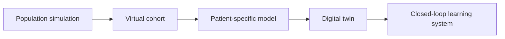

Most medical AI is trained to look backward. It learns from patients who have already been observed and predicts a label: deterioration, readmission, treatment response, or diagnostic probability.

But many of medicine's hardest questions are not prediction questions.

What happens if the dose changes? Which tissue should be ablated? How would a device perform in an anatomy that was rare in the original trial? What if a hospital changes its staffing or triage policy?

These are intervention questions. Historical data alone contain only the actions that were actually taken. Simulation adds something different: a controlled world in which alternative actions can be tried before they reach a patient.

> The next important layer of medical AI may not be another predictor. It may be an environment in which predictions can be turned into experiments.

## The Earlier Form of Simulation

Traditional simulation begins with a stated mechanism. In a classroom flu model, if 60 classmates each independently faced a 1% infection probability, expected first-day infections were `60 × 0.01 = 0.60`. If repeated runs did not approach that value, the implementation or the stated assumptions needed review.

This is still the right starting point: check simple expectations, edge cases, and conservation rules before trusting larger outputs. Such models are transparent but usually generic; medical AI can help personalize or update them.

## Simulation Is Already Part of Medical Evidence

This direction is not speculative. Pharmacokinetic and physiologically based models already connect dose, exposure, efficacy, and safety; the FDA's final [ICH M15 guidance](https://www.fda.gov/regulatory-information/search-fda-guidance-documents/m15-general-principles-model-informed-drug-development), issued in June 2026, sets out a framework for model-informed drug-development evidence. For devices, a [risk-informed credibility framework](https://www.fda.gov/regulatory-information/search-fda-guidance-documents/assessing-credibility-computational-modeling-and-simulation-medical-device-submissions) addresses mechanistic simulations.

VICTRE created virtual breast anatomies, inserted lesions, simulated image acquisition, and compared two imaging modalities in an in silico trial. Across drug, device, workflow, and patient-specific models, the goal is the same: test a defined question in a controlled representation of the system.

## AI and Simulation Solve Opposite Problems

Traditional simulation is strongest where mechanisms are known; machine learning is strongest where data are abundant. A hybrid model combines a mechanistic prediction with an AI-learned residual: patient data personalize parameters, AI fills limited gaps or accelerates solvers, and the mechanism constrains states and interventions. A published pharmacokinetic example combines deep learning for molecular properties with a physiologically based model for concentration-time profiles.

## From Population Models to Patient-Specific Experiments

A **population simulation** varies assumptions; a **virtual cohort** varies simulated patients; a **patient-specific model** is calibrated to one person; and a **digital twin** also updates with observations. A closed-loop system recalibrates from resulting actions.

In a 2026 10-person feasibility study, heart models identified ventricular-tachycardia ablation targets before procedures. Ventricular tachycardia was noninducible after ablation in all participants; at mean 13-month follow-up, eight were recurrence-free without antiarrhythmic medication. It is a step toward treatment planning, not evidence for routine use.

## A Plausible Synthetic Patient Is Not Yet a Simulator

Generative AI can produce realistic-looking records, trajectories, and patient profiles for education, testing, or data augmentation. But realism is not intervention validity: a language model may imitate laboratory results after a medication change without representing the processes that connect drug and outcome.

For a simulator to support a medical decision, it needs a defined **context of use**, a defensible intervention mechanism, calibration to the represented patient or population, uncertainty that grows outside its evidence base, and validation against decision-relevant outcomes.

This is the central boundary for AI-era simulation:

> A model becomes medically useful not when it can generate a believable future, but when it can distinguish which futures its evidence allows it to compare.

## The First Equation Still Matters

The flu model’s lesson remains: verification starts with simple expectations and edge cases. For an AI-enabled simulator, ask:

- Did the code implement the model?
- Does the model represent the relevant mechanism?
- Can its parameters be identified and intervention correspond to a real action?
- How does uncertainty reach the recommended decision, and what changes when new data disagree?

Ten thousand runs cannot rescue a wrong mechanism. Neither can a foundation model. The opportunity is to build constrained experimental worlds where interventions can be tested virtually, uncertainty stays visible, and real-world feedback keeps the model honest.

## Sources

- U.S. Food and Drug Administration. [Modeling & Simulation at FDA](https://www.fda.gov/science-research/about-science-research-fda/modeling-simulation-fda).
- U.S. Food and Drug Administration. [M15 General Principles for Model-Informed Drug Development](https://www.fda.gov/regulatory-information/search-fda-guidance-documents/m15-general-principles-model-informed-drug-development). Final guidance, June 2026.
- U.S. Food and Drug Administration. [Assessing the Credibility of Computational Modeling and Simulation in Medical Device Submissions](https://www.fda.gov/regulatory-information/search-fda-guidance-documents/assessing-credibility-computational-modeling-and-simulation-medical-device-submissions). Final guidance, November 2023.
- Sharma D, Graff CG, Badal A, et al. [In Silico Imaging Tools from the VICTRE Clinical Trial](https://doi.org/10.1002/mp.13674). *Medical Physics*. 2019;46(9):3924-3928.
- Gruber A, Führer F, Menz S, et al. [Prediction of Human Pharmacokinetics from Chemical Structure: Combining Mechanistic Modeling with Machine Learning](https://doi.org/10.1016/j.xphs.2023.10.035). *Journal of Pharmaceutical Sciences*. 2024.
- Chrispin J, Prakosa A, Kholmovski E, et al. [Digital Twin-Guided Ablation for Ventricular Tachycardia](https://doi.org/10.1056/NEJMc2517822). *New England Journal of Medicine*. 2026;394:1345-1347.
